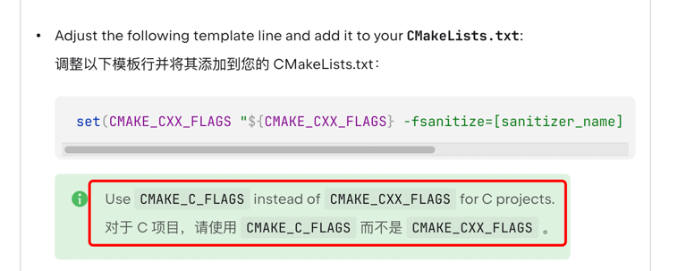
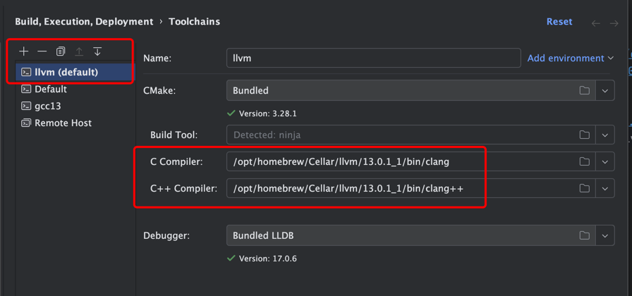
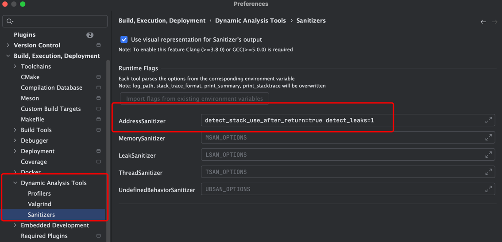
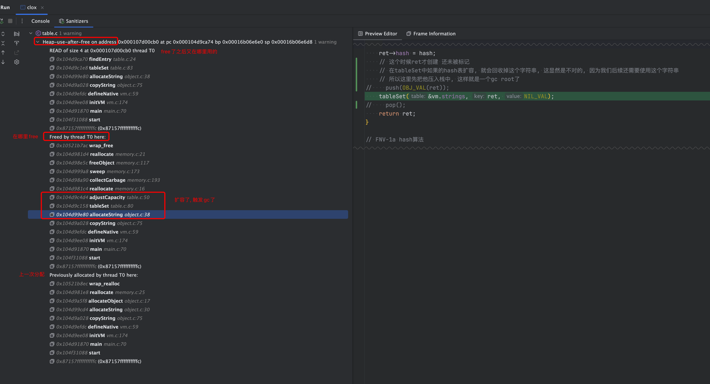

实现gc的时候遇到很诡异的内存问题, 记录一下怎么在m1 mac下debug

在确定是内存问题后, 可以使用现有的工具来帮忙检测诸如:
1. 使用了free后的内存
2. double free
3. 越界
4. ...

# 如何使用工具
这里使用的工具是sanitizers
1. clion 文档: https://www.jetbrains.com/help/clion/google-sanitizers.html#SanitizersSettings
2. 其他人的文档: https://zhuanlan.zhihu.com/p/508470880

这里记录几个易错点:
1. 对于C语言项目的cmake指令和c++不同 
2. 苹果自带的c/cpp编译期貌似不支持这些工具, 改为用llvm的c/cpp编译器 
3. 这个必须要配, 不然没用 

**上面三点必须全部配置正确不然没用**

如果还不成功请自己构造一个越界/内存泄露的例子来测试

# 用工具来debug的思路
我遇到的问题是 使用了已经free的内存
我在使用处看了半天, 一行一行debug 发现了端倪, 但是这个时候程序中的状态还比较简单, 所以比较好发现

想了一下 实际上看是哪里free的这块内存 应该能更快速找到问题的原因

比如下面这段代码

tableSet中可能会扩容, 扩容的时候就会free内存, 然后顺着调用的方法栈向外找, 就能找到这个函数

错误的原因写在了注释中
```c
static ObjString *allocateString(char *str, int length, uint32_t hash) {
    ObjString *ret = ALLOCATE_OBJ(ObjString, OBJ_STRING);
    ret->length = length;
    ret->chars = str;
    ret->hash = hash;
    // 这个时候ret才创建 还未被标记
    // 在tableSet中如果的hash表扩容, 就会回收掉这个字符串, 这显然是不对的, 因为我们后续还需要使用这个字符串
    // 所以这里先把他压入栈中, 这样就是一个gc root了
    push(OBJ_VAL(ret));
    tableSet(&vm.strings, ret, NIL_VAL);
    pop();
    return ret;
}
```

实际再遇到问题还是要具体分析


